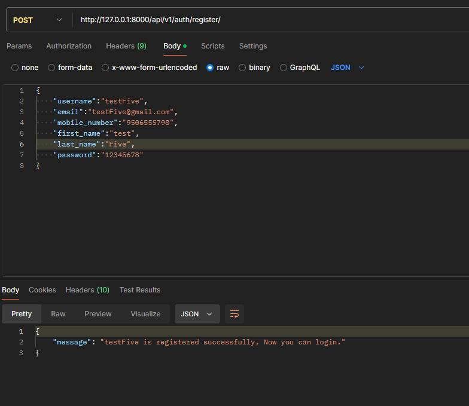
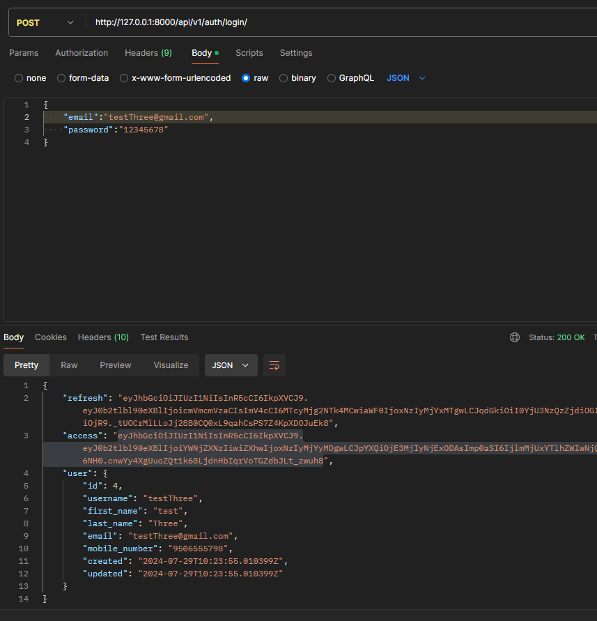
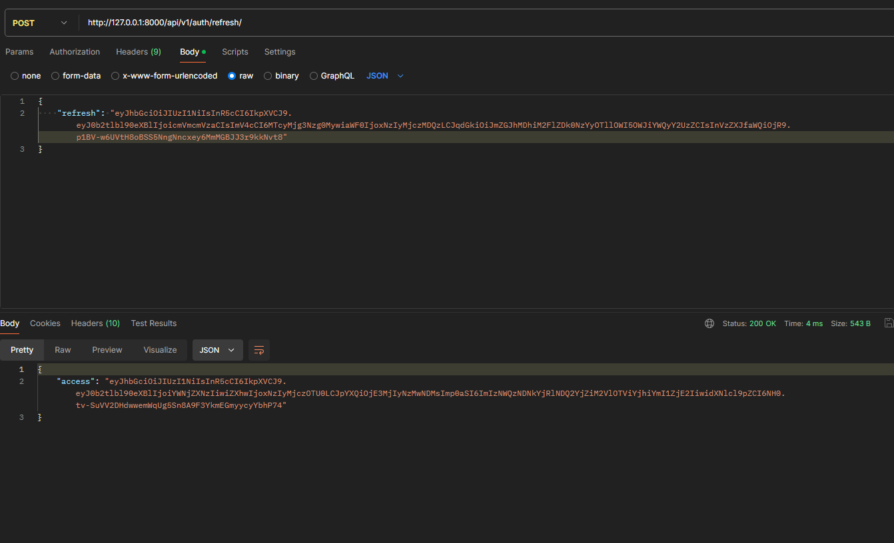
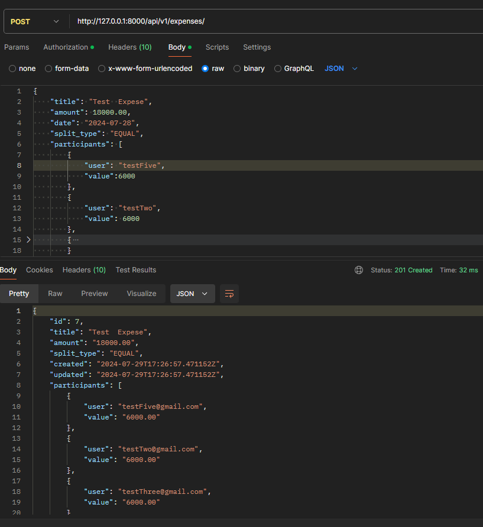
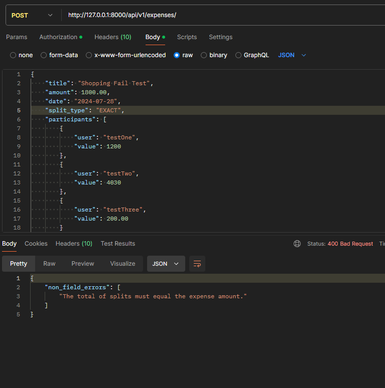
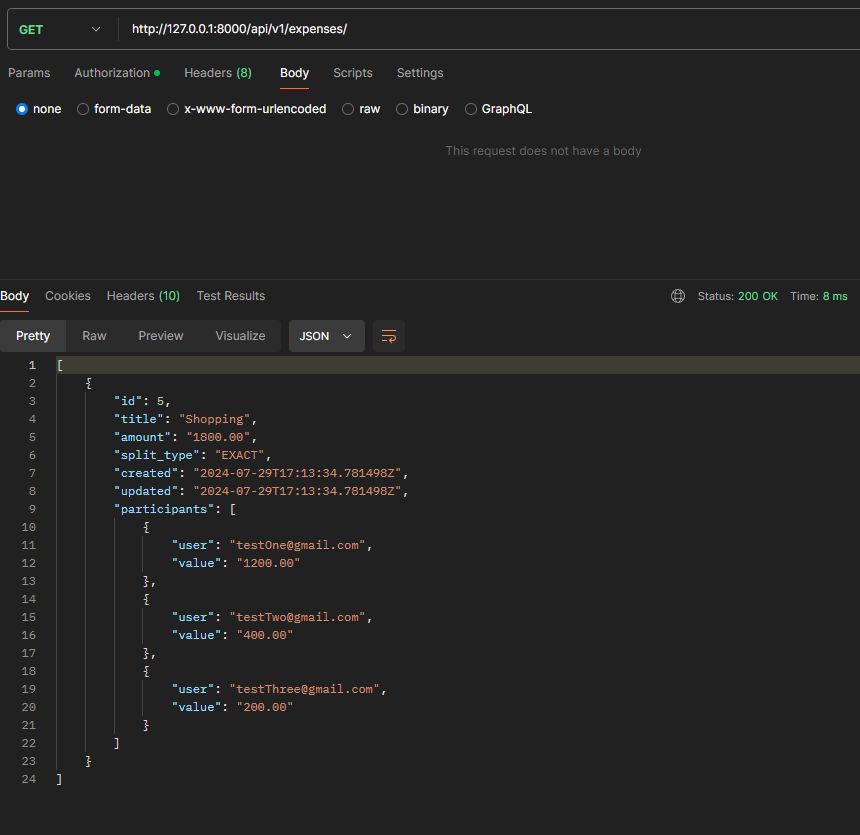
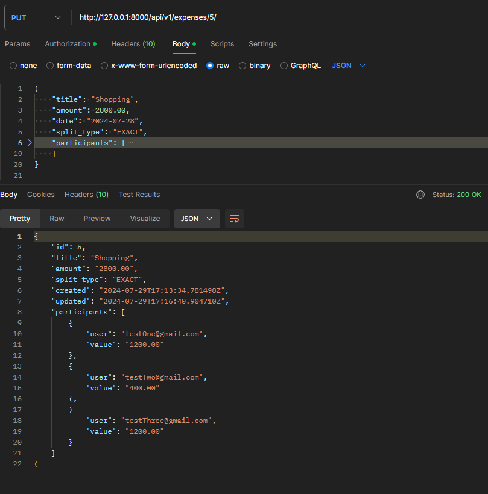
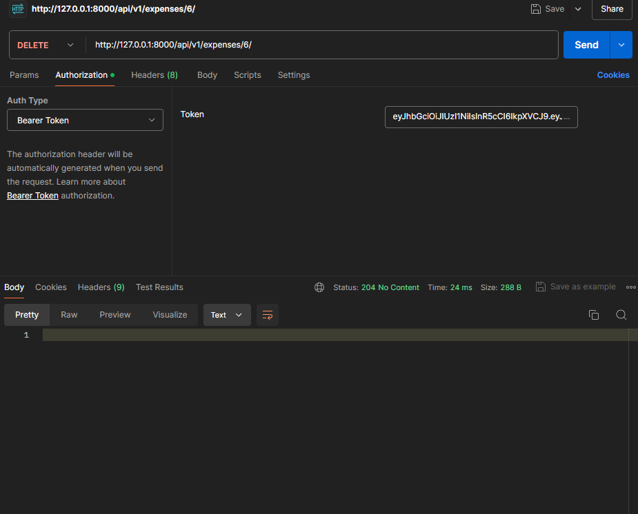
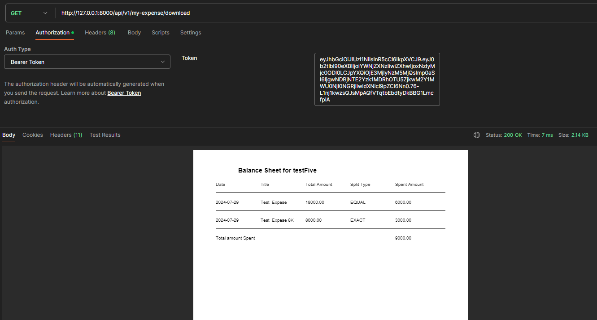

# Expense Sharing API

---

## Models :

### User

The `User` model is a custom user model extending Django's `AbstractBaseUser` and `PermissionsMixin` to include additional fields for email and mobile number.

| Field           | Type            | Description                                                        | Constraints               |
| --------------- | --------------- | ------------------------------------------------------------------ | ------------------------- |
| `username`      | `CharField`     | The username of the user. Max length: 255 characters.              | Unique, Indexed           |
| `first_name`    | `CharField`     | The first name of the user. Max length: 255 characters.            | -                         |
| `last_name`     | `CharField`     | The last name of the user. Max length: 255 characters.             | -                         |
| `email`         | `EmailField`    | The email address of the user.                                     | Unique, Indexed           |
| `mobile_number` | `CharField`     | The mobile number of the user. Assumed to be 10 digits from India. | Indexed                   |
| `is_active`     | `BooleanField`  | Indicates whether the user is active.                              | Default: True             |
| `is_superuser`  | `BooleanField`  | Indicates whether the user has superuser privileges.               | Default: False            |
| `is_staff`      | `BooleanField`  | Indicates whether the user can log into the admin site.            | Default: False            |
| `created`       | `DateTimeField` | The date and time when the user was created.                       | Auto-updated on each save |
| `updated`       | `DateTimeField` | The date and time when the user was last updated.                  | Auto-set on creation      |

#### Required Fields

As defined in the requirement users must have email, name and mobile number and Password.

- `email` (Used as the username for authentication)
- `username`
- `mobile_number`
- `first_name`
- `last_name`

#### Methods

- `__str__()`: Returns a string representation of the user, showing the email address.

### Expense

| Field        | Type               | Description                                                                         | Choices                                                                                       |
| ------------ | ------------------ | ----------------------------------------------------------------------------------- | --------------------------------------------------------------------------------------------- |
| `owner`      | `ForeignKey(User)` | The user who created the expense. Deleted if the user is deleted.                   | -                                                                                             |
| `title`      | `CharField`        | The title of the expense. Max length: 255 characters.                               | -                                                                                             |
| `amount`     | `DecimalField`     | The amount of the expense. Max digits: 10, Decimal places: 2.                       | -                                                                                             |
| `split_type` | `CharField`        | The method used to split the expense. Max length: 20 characters.                    | `EXACT` (Specify Amount), `EQUAL` (Divide Equally), `PERCENTAGE` (Divide based on Percentage) |
| `created`    | `DateTimeField`    | Automatically set to the current date and time when the expense is created.         | -                                                                                             |
| `updated`    | `DateTimeField`    | Automatically updated to the current date and time whenever the expense is updated. | -                                                                                             |

#### Methods

- `__str__()`: Returns a string representation of the expense, showing the first 15 characters of the title and the amount in INR.

---

### ExpenseSplit

| Field     | Type                  | Description                                                          |
| --------- | --------------------- | -------------------------------------------------------------------- |
| `expense` | `ForeignKey(Expense)` | The related expense. Deleted if the expense is deleted.              |
| `user`    | `ForeignKey(User)`    | The user associated with this split. Deleted if the user is deleted. |
| `value`   | `DecimalField`        | The value of the expense split. Max digits: 10, Decimal places: 2.   |

#### Methods

- `__str__()`: Returns a string representation of the expense split, showing the user and the value.

---

## How to run Locally

1. create a directory and move to newwly created directory

```shell
mkdir expense-app
cd expense-app
```

2. Make an virtual environment and enable the virtual environment

```shell
# for windows
# creating virtual environment
python -m venv venv

# for linux or unix machine
# creating virtual environment
python3 -m venv venv
```

3. Clone the project

```bash
  git clone https://github.com/AbhiMisRaw/expense-share-api.git
```

4. Activate virtual environment.

```shell
# activating virtual environment
venv\Script\activate

# activating virtual environment
source venv/bin/activate
```

5. Go to the cloned project directory

```bash
  cd expense-share-api
```

6. Install dependencies

```bash
  pip install -r requirements.txt
```

7. Create `.env` file and create `SECRET_KEY` for project.

```shell
echo DJANGO_SECRET_KEY='<ANY-SECRET-KEY>' > .env
```

8. Run migrations

```bash
  python manage.py makemigrations
  python manage.py migrate
```

9. Start the server

```bash
    # for windows
    python manage.py runserver

    # for linux and unix machine
    python3 manage.py runserver
```

---

# Expense API Documentation

---

## Base URL

The base URL for all endpoints is `/api/v1/`.

## Endpoints

### Admin

- **URL:** `/admin/`
- **Method:** GET
- **Description:** Django admin interface.

### Authentication

1. **Register User**

   - **URL:** `/api/v1/auth/register/`
   - **Method:** POST
   - **Description:** Register a new user.
   - **Request Body:**
     ```json
     {
       "username": "string",
       "email": "string",
       "first_name": "string",
       "last_name": "string",
       "mobile_number": "string",
       "password": "string"
     }
     ```
   - **Response:**
     ```json
     {
       "id": "integer",
       "username": "string",
       "email": "string"
     }
     ```

2. **Login User**

   - **URL:** `/api/v1/auth/login/`
   - **Method:** POST
   - **Description:** Authenticate an existing user.
   - **Request Body:**
     ```json
     {
       "email": "string",
       "password": "string"
     }
     ```
   - **Response:**
     ```json
     {
       "token": "string"
     }
     ```

3. **Refresh Token**
   - **URL:** `/api/v1/auth/refresh/`
   - **Method:** POST
   - **Description:** Refresh an authentication token.
   - **Request Body:**
     ```json
     {
       "refresh_token": "string"
     }
     ```
   - **Response:**
     ```json
     {
       "token": "string"
     }
     ```

### Users

- **URL:** `/api/v1/auth/users/`
- **Method:** GET
- **Description:** Retrieve a list of all users.
- **Response:**
  ```json
  [
    {
      "id": "integer",
      "username": "string",
      "email": "string"
    }
  ]
  ```

### Expenses

1. **List Expenses**

   - **URL:** `/api/v1/expenses/`
   - **Method:** `GET`
   - **Description:** Retrieve a list of all expenses which are created by `authenticated user`.
   - **Response:**
     ```json
     [
       {
         "id": "integer",
         "amount": "decimal",
         "title": "string",
         "split_type": "ENUM (EQUAL, EXACT, PERCENTAGE)",,
         "created": "date",
         "participants": [{
           "value": "decimal",
           "username": "string"
         }]
       }
     ]
     ```

2. **Create Expense**

   - **URL:** `/api/v1/expenses/`
   - **Method:** `POST`
   - **Description:** Create a new expense.
   - **Request Body:**
     ```json
     {
         "id": "integer",
         "amount": "decimal",
         "title": "string",
         "split_type": "ENUM (EQUAL, EXACT, PERCENTAGE)",,
         "created": "date",
         "participants": [{
           "value": "decimal",
           "username": "string"
         }]
       } n
     ```
   - **Response:**
     ```json
     {
       "id": "integer",
       "amount": "decimal",
       "description": "string",
       "date": "date",
       "user": {
         "id": "integer",
         "username": "string"
       }
     }
     ```

3. **Retrieve Single Expense**

   - **URL:** `/api/v1/expenses/{id}/`
   - **Method:** `GET`
   - **Description:** Retrieve details of a single expense.
   - **Response:**
     ```json
     {
       "id": "integer",
       "amount": "decimal",
       "description": "string",
       "date": "date",
       "user": {
         "id": "integer",
         "username": "string"
       }
     }
     ```

4. **Update Expense**

   - **URL:** `/api/v1/expenses/{id}/`
   - **Method:** `PUT`
   - **Description:** Update an existing expense.
   - **Request Body:**
     ```json
     {
       "amount": "decimal",
       "description": "string",
       "date": "date",
       "user": "integer"
     }
     ```
   - **Response:**
     ```json
     {
       "id": "integer",
       "amount": "decimal",
       "description": "string",
       "date": "date",
       "user": {
         "id": "integer",
         "username": "string"
       }
     }
     ```

5. **Delete Expense**
   - **URL:** `/api/v1/expenses/{id}/`
   - **Method:** `DELETE`
   - **Description:** Delete an existing expense.
   - **Response:** `204 No Content`

### Expense Sharing

1. **Share Expenses**

   - **URL:** `/api/v1/expenses/share/`
   - **Method:** `GET`
   - **Description:** This enpoints shows only those expense which are shared by others to `authenticated user`.

   - **Response:**
     ```json
     [
       {
         "id": "integer",
         "amount": "decimal",
         "title": "string",
         "split_type": "ENUM (EQUAL, EXACT, PERCENTAGE)",,
         "created": "date",
         "participants": [{
           "value": "decimal",
           "username": "string"
         }]
       }
     ]
     ```

2. **Retrieve Shared Expense Details**

   - **URL:** `/api/v1/expenses/share/{id}/`
   - **Method:** `GET`
   - **Description:** Retrieve details of a shared expense.
   - **Response:**
     ```json
     {
         "id": "integer",
         "amount": "decimal",
         "title": "string",
         "split_type": "ENUM (EQUAL, EXACT, PERCENTAGE)",,
         "created": "date",
         "participants": [{
           "value": "decimal",
           "username": "string"
         }]
       }
     ```

3. **Download Single Shared Expense**

   - **URL:** `/api/v1/expenses/share/{id}/download/`
   - **Method:** GET
   - **Description:** Download a single shared expense as a file.
   - **Response:** Binary file download.

4. **Download My Total Expenses**

   - **URL:** `/api/v1/my-expense/download/`
   - **Method:** GET
   - **Description:** Download a summary of all expenses related to the authenticated user.
   - **Response:** Binary file download.

   ***

## Images

1. User Registration.
   
   <br>

2. User Login.
   
   <br>

3. Get a `Access Token` from `Refresh Token`,
   

4. Creating an expense.
   
   <br>


<br>

- Failed creation of Expense becuase of Validation.



<br>

5. Get All Expenses.
   
   <br>

6. Updating an Expense.
   

<br>

7. Deleting an Expense.
   

8. Downloading Blanace Sheet pdf All the Expense of `Authenticated User`.
   

> User can also view and download an individual Expense weather expense is created by him or shared by others to user However I didn't added any pictures of it.

## Support

For support, email abhiimiishra@gmail.com
